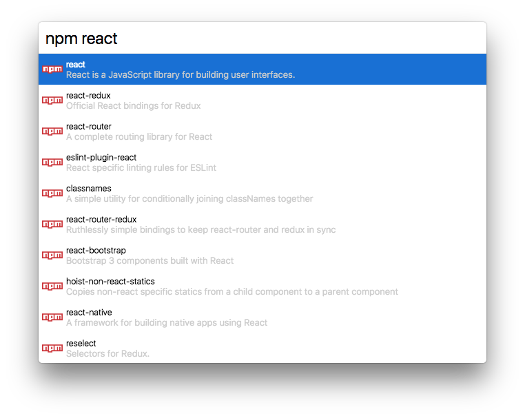

# cerebro-npm
> Cerebro plugin to search NPM packages

## Usage
Search for NPM packages using "**npm** [search term]".

<kbd>Return</kbd> - Open a package on the NPM website.

<kbd>cmd+c</kbd> - Copy the install command eg. `npm install -S react`

## License
MIT © Jordan Adams
